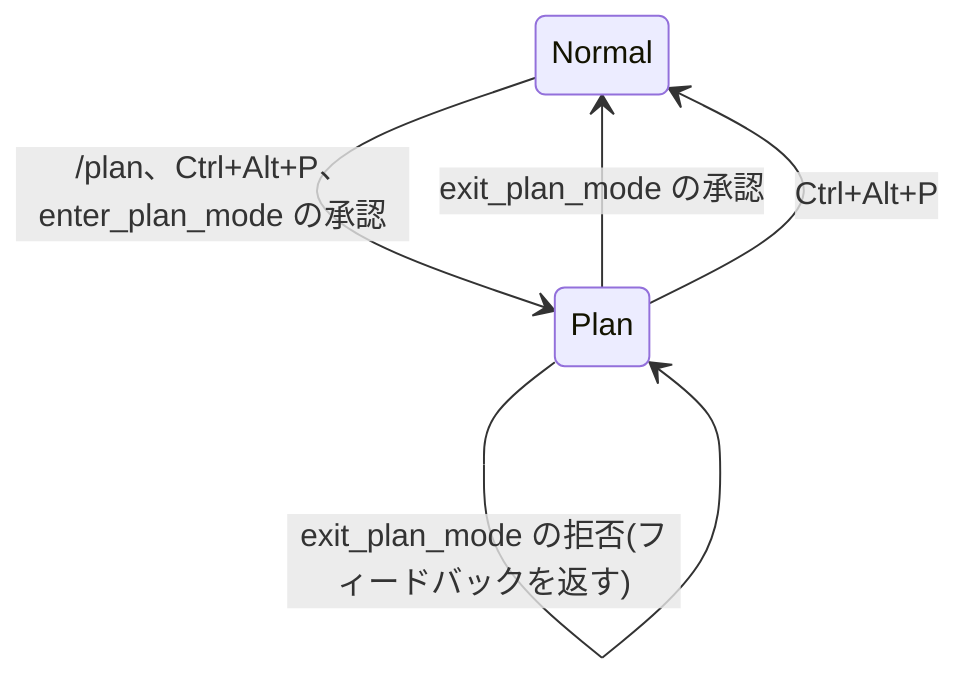

# 設計思想 — pi-plan

読者は pi-plan を変更する開発者と AI エージェントです。共通の哲学は [PHILOSOPHY.md](PHILOSOPHY.md)、検証可能な制約と変更手順は [AGENTS.md](AGENTS.md) にあります。

## 何を解くか

Claude Code の plan mode を pi の拡張として再現します。plan mode は、実装前に調査し、プランをファイルに書き、ユーザーの承認を得るまでモデルに書き込みを控えさせるモードです。

判断基準は Claude Code との互換性です。互換性を優先し、pi の制約で再現できない差だけを許容します。差はこの文書にすべて記録します。対応の基準は逆コンパイル済み Claude Code v2.1.88 で、参照元は [collection-claude-code-source-code](https://github.com/chauncygu/collection-claude-code-source-code) の `original-source-code` です。参照する主な箇所は `src/utils/messages.ts`(プロンプト)、`src/utils/plans.ts`(プランファイル)、`src/utils/permissions/permissionSetup.ts`(モード遷移)です。

## 要点

- plan mode 中はプランファイル以外への書き込みをプロンプトで禁止する。
- モデルは `exit_plan_mode` の承認なしに plan mode を終了できない。
- ユーザーは Ctrl+Alt+P で承認なしに終了できる(Claude Code の Shift+Tab に対応)。
- 権限モード、コンテキストクリア、組み込みサブエージェントは再現しない。
- 差の一覧は「Claude Code との差」を参照する。

## 全体像

plan mode の中では次の制約が常に有効です。

| 制約 | 内容 |
|---|---|
| 読み取り専用 | プランファイル以外への `write` と `edit` をプロンプトで禁止する |
| Bash 制限 | 非読み取り専用のコマンドをプロンプトで禁止する |
| モデルの出口 | `exit_plan_mode` の承認だけが plan mode を終了する |
| ユーザーの出口 | Ctrl+Alt+P のトグルオフで承認なしに終了できる |
| ターン終了 | ターンは質問か `exit_plan_mode` のどちらかで終える |

## 固有の原則

### 互換を先に、差は記録する

Claude Code に名前・順序・文言の対応する機構がある場合は、pi で実現できる限り同じにします。実現できない場合だけ差を作り、「Claude Code との差」に理由を記録します。

- システムプロンプトとツール説明文は Claude Code の英語文面を基にする。
- 置換はパス・サブエージェント名だけに留める。
- 質問ツールは pi に標準がないため、特定の名前を使わない一般的な表現にする。
- full は 5 フェーズの全体、sparse は「plan mode 継続中」の要約 1 段落とする。

### プランはファイルが正

プラン本文の唯一の正はプランファイルです。`exit_plan_mode` は本文を引数で受け取らず、ファイルから読みます。ユーザーが承認前に編集した場合は、編集後の内容を承認結果としてモデルへ返します。モデルが `exit_plan_mode` を呼んだ時点のファイル内容と、承認後の内容が異なる場合は「edited by user」と明示します。

### モデルの出口は承認だけ

モデルが plan mode を終了できるのは `exit_plan_mode` の承認だけです。モデルには「ターンは質問か `exit_plan_mode` のどちらかで終える」ことをプロンプトで指示します。プラン承認を通常のテキストや質問ツールで尋ねることは禁止します。

ユーザーは Ctrl+Alt+P で plan mode を終了できます(Claude Code の Shift+Tab に対応)。この経路でも終了通知を 1 回だけ注入します。

承認 UI の選択肢は次の 3 つとします。Claude Code の承認ダイアログから権限モード関連の選択肢を除いたものです。

| 選択肢 | 遷移 | モデルへの返却 |
|---|---|---|
| 実行 | Plan を終了する | 承認済みプラン全文 |
| 編集して実行 | Plan を終了する | 編集後のプラン全文(edited by user と明示) |
| 継続 | Plan のまま | 拒否の事実とユーザーのフィードバック |

### 読み取り専用はプロンプトで指示する

Claude Code はプロンプトで読み取り専用を指示し、違反時は権限プロンプトでユーザーに確認します。pi に権限プロンプトのモードはないため、pi-plan は読み取り専用を守るようプロンプトで指示します。

- プランファイル以外への `write`/`edit` を禁止する。
- Bash を含む非読み取り専用の操作を禁止する。
- ブロック、確認ダイアログ、Bash 許可リストは置かない。

モデルが指示に反して書き込んだ場合、それを止める仕組みはありません。これは権限プロンプト層を再現しないことによる差です。

### プロンプトは Claude Code と同じ規則で間引く

| 規則 | 値 |
|---|---|
| 注入間隔 | ユーザーターン 5 回ごと |
| full の頻度 | 注入 5 回に 1 回 |
| 再突入 | 終了済みかつプランファイルが存在するときだけ 1 回 |
| 終了通知 | plan mode 終了直後の 1 回だけ |
| compaction 後 | full を再注入する |

カウンタは人間のユーザーメッセージで進め、承認や compaction(文脈の自動要約)ではリセットしません。

### 状態はセッションに永続化する

プラン本文はファイルに保存し、entry(pi のセッション記録)には保存しません。

| 状態 | 保存タイミング | 復元 |
|---|---|---|
| モードと終了済みフラグ | 変化のたび | `session_start` で分岐から復元する |
| プランの slug | 初回生成時と fork 時 | 再開時に復元し、ファイルを読み直す |
| プロンプト注入カウンタ | 別途保存しない | 再開時に分岐のメッセージから数え直す |
| 承認待ち状態 | 別途保存しない | 再開時も plan mode のままにする |
| プランファイルの欠落 | — | プランなしとして扱い、full を注入する |

## 互換性マトリクス

区分の意味は次のとおりです。

| 区分 | 意味 |
|---|---|
| 互換 | 名前・順序・文言を同じにする |
| 近似 | 意味は同じだが実現方法か名前が違う |
| 差 | 機能が欠ける、または挙動が変わる |

| 機構 | Claude Code | pi-plan | 区分 |
|---|---|---|---|
| 開始(ユーザー) | `/plan`、`/plan <タスク>` | 同じ | 互換 |
| 開始(モデル) | `EnterPlanMode` と同意ダイアログ | `enter_plan_mode` と同意ダイアログ | 近似 |
| 開始(ショートカット) | Shift+Tab | Ctrl+Alt+P | 差 |
| 開始(CLI) | `--permission-mode plan` | `--plan` | 差 |
| 状態表示 | `⏸ plan mode on` | `⏸ plan mode on` | 互換 |
| モードの退避 | `prePlanMode` | 退避なし | 差 |
| プランファイル | `~/.claude/plans/<slug>.md` | `~/.pi/agent/plans/<slug>.md` | 近似 |
| slug の規則 | 単語 2 語、衝突リトライ、再開で再利用、fork で再生成 | 同じ | 互換 |
| 本文の正 | ファイル | ファイル | 互換 |
| プランファイルへの書き込み | 許可 | 許可 | 互換 |
| その他の write/edit | プロンプト指示と権限プロンプト | プロンプト指示のみ | 差 |
| Bash | プロンプト指示とコマンド単位の権限プロンプト | プロンプト指示のみ | 差 |
| システムプロンプト | 5 フェーズ、full/sparse(5/5) | 同じ規則・文面 | 互換 |
| 質問ツール | `AskUserQuestion` | 特定の名前を使わない一般的な表現 | 差 |
| 探索/計画エージェント | Explore/Plan を 1〜3 並列 | subagent があれば推奨、なければ直接探索 | 差 |
| 承認 UI | プラン表示と複数選択肢 | プラン表示と実行/編集/継続 | 近似 |
| 承認後のコンテキストクリア | あり | なし | 差 |
| 承認後の権限モード | acceptEdits/auto/bypass/default から選択 | なし | 差 |
| 承認結果 | プラン全文のエコーと編集印 | 同じ | 互換 |
| 再突入 | `plan_mode_reentry` | 同じ | 互換 |
| 終了通知 | `plan_mode_exit`(一度きり) | 同じ | 互換 |
| compaction 後 | full を再注入 | 同じ | 互換 |
| ツール名 | `EnterPlanMode`/`ExitPlanMode` | `enter_plan_mode`/`exit_plan_mode` | 差 |
| `allowedPrompts` | Ant 限定 | なし | 差 |
| サブエージェントの plan file | `<slug>-agent-<id>.md` | なし | 差 |
| auto mode と classifier | あり | なし | 差 |
| Ultraplan と team 承認 | あり | なし | 差 |
| Phase 4 のバリアント | 実験で切り替え | control 固定 | 差 |

各「差」の理由は次の節にあります。

| 差の機構 | 説明する節 |
|---|---|
| 開始(ショートカット) | ショートカット |
| 開始(CLI)、ツール名 | 名前と保存先 |
| モードの退避、承認後の権限モード | 権限モデル |
| その他の write/edit、Bash | 読み取り専用の扱い |
| 探索/計画エージェント | サブエージェント |
| 承認後のコンテキストクリア | コンテキストクリア承認 |
| 質問ツール | 名前と保存先 |
| `allowedPrompts` | 対応しない機能 |
| サブエージェントの plan file | 対応しない機能 |
| auto mode と classifier | 対応しない機能 |
| Ultraplan と team 承認 | 対応しない機能 |
| Phase 4 のバリアント | 対応しない機能 |

## Claude Code との差

### 権限モデル

Claude Code の plan mode は 6 つの権限モード(`default`/`acceptEdits`/`plan`/`auto`/`dontAsk`/`bypassPermissions`)の 1 つです。開始前のモードを `prePlanMode` に退避し、承認時に `acceptEdits`/`auto`/`bypassPermissions`/`default` から復帰先を選びます。

pi に権限モードはありません。pi-plan はモードの退避・復元をしません。そのため承認 UI に「コンテキストクリア」「auto mode」「bypass permissions」は出さず、実行・編集・継続の三択にします。

### コンテキストクリア承認

Claude Code は承認時にコンテキストクリア(clear context)を選べます。選ぶと新しいセッションで実装を開始します。

pi でセッションを切り替える `ctx.newSession()` はコマンドハンドラ専用で、ツール実行やライフサイクルイベントからは呼べません。初期版では非対応とし、将来コマンドとして追加する余地だけ残します。

### 読み取り専用の扱い

Claude Code はプロンプトで読み取り専用を指示し、違反時は権限プロンプトを出します。ユーザーは拒否も許可もできます。

pi に権限プロンプトのモードはないため、pi-plan は読み取り専用を守るようプロンプトで指示します。ブロックや確認ダイアログは置きません。plan mode 中にモデルが指示に反して書き込んだ場合、それを止める仕組みはありません。これは Claude Code よりも弱い方向の差です。

### ショートカット

Shift+Tab は pi の `app.thinking.cycle`(thinking level の切替)に予約されています。拡張からの上書きは警告のうえ破棄されます。

既定は Ctrl+Alt+P とします。ユーザーが `keybindings.json` で thinking cycle を別キーに移せば Shift+Tab を登録できる余地はありますが、初期版は対応しません。

### サブエージェント

Claude Code は組み込みの Explore/Plan サブエージェントを 1〜3 並列で起動し、契約に応じて数を変えます。

pi に同等の組み込みエージェントはありません。pi-plan は subagent ツールが存在すれば使うよう促すだけです。並列数は指示せず、直接探索も許します。

### 名前と保存先

pi の命名規則(snake_case)に合わせて `enter_plan_mode`/`exit_plan_mode` とします。システムプロンプトとツール説明文は Claude Code の英語文面を基にします。

pi に標準の質問ツールはないため、Claude Code の `AskUserQuestion` は特定のツール名を使わない一般的な表現に置き換えます。

プランファイルの保存先は `~/.pi/agent/plans/` です(`PI_CODING_AGENT_DIR` に追従)。CLI は Claude Code の `--permission-mode plan` ではなく、拡張フラグの `--plan` を提供します。

### 対応しない機能

次の機能は pi に対応する基盤がない、または pi-plan の責務を超えるため対応しません。

- auto mode と classifier(行動を自動承認する別モデル)
- Ultraplan(Web 上の計画サービス)
- team/teammate の承認フロー
- `allowedPrompts`(Ant 社内限定)による意味的権限要求
- サブエージェント専用の plan file
- Phase 4 の A/B バリアント(trim/cut/cap)

## 意図的にやらないこと

固有の原則の具体例です。提案時に最初に確認します。

- pi への権限モードの導入(plan 状態は拡張内の状態として管理する)
- 権限プロンプト機構の再実装
- 読み取り専用の技術的な強制(ブロック、確認ダイアログ、Bash 許可リスト)
- plan mode の自動タイムアウトや自動終了
- 非対話モードでの承認(必ずブロックし、理由をモデルへ返す)
- プラン本文の entry 保存(ファイルだけに保存する)
- ユーザー承認なしの `exit_plan_mode` 通過
